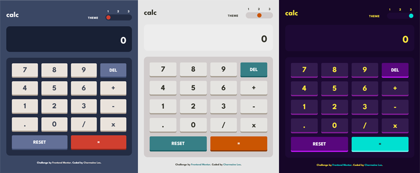

# Frontend Mentor - Calculator app solution

This is a solution to the [Calculator app challenge on Frontend Mentor](https://www.frontendmentor.io/challenges/calculator-app-9lteq5N29). Frontend Mentor challenges help you improve your coding skills by building realistic projects.

## Table of contents

- [Overview](#overview)
  - [The challenge](#the-challenge)
  - [Screenshot](#screenshot)
  - [Links](#links)
- [My process](#my-process)
  - [Built with](#built-with)
  - [What I learned](#what-i-learned)
  - [Continued development](#continued-development)
  - [Useful resources](#useful-resources)
- [Author](#author)
- [Acknowledgments](#acknowledgments)

## Overview

### The challenge

Users should be able to:

- See the size of the elements adjust based on their device's screen size
- Perform mathmatical operations like addition, subtraction, multiplication, and division
- Adjust the color theme based on their preference
- **Bonus**: Have their initial theme preference checked using `prefers-color-scheme` and have any additional changes saved in the browser

### Screenshot

### Links

- Solution URL: [Frontend Mentor Solution Page](https://www.frontendmentor.io/solutions/calculator-app-sass-vanilla-js-pWn3gavOA6)
- Live Site URL: [Live site powered by Netlify](https://fmentor-calculator.netlify.app/)

## My process

### Built with

- Semantic HTML5 markup
- SASS
- Flexbox
- CSS Grid
- Mobile-first workflow

### Useful resources

- [Three-way Toggle Codepen](https://codepen.io/magnus16/pen/grzqMz) - This helped me understand how a toggle can be built, and how I can use CSS to change the toggle when any one radio button has been selected.

## Author

- Website - [Charmaine Lee](https://charmainelhm.netlify.app/)
- Frontend Mentor - [@charmainelhm](https://www.frontendmentor.io/profile/charmainelhm)
- Twitter - [@noodercob_ie](https://www.twitter.com/noodercob_ie)
